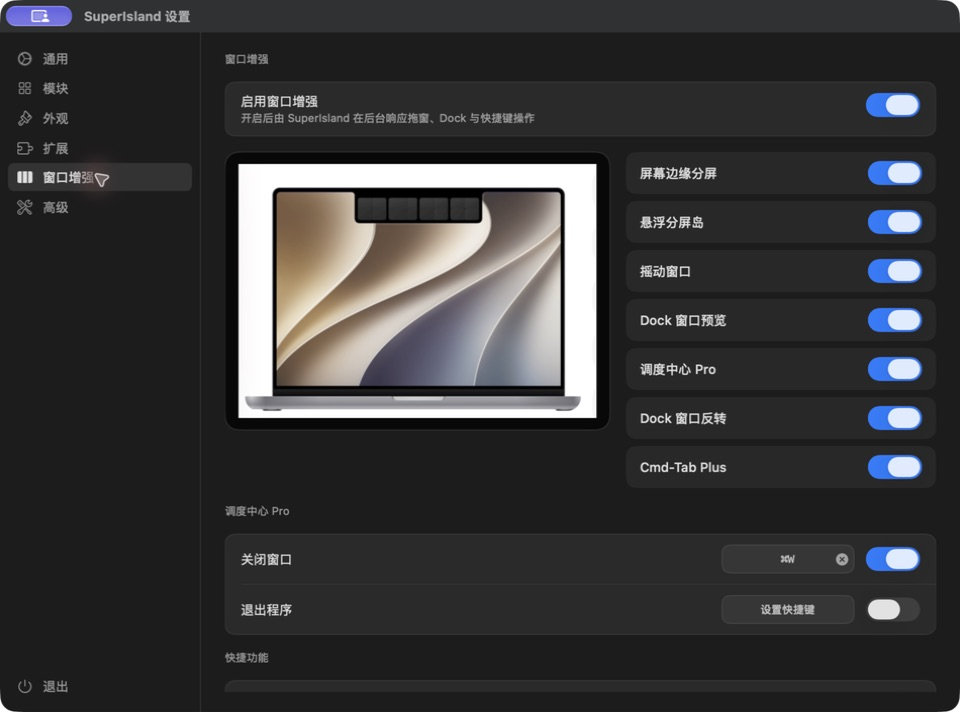
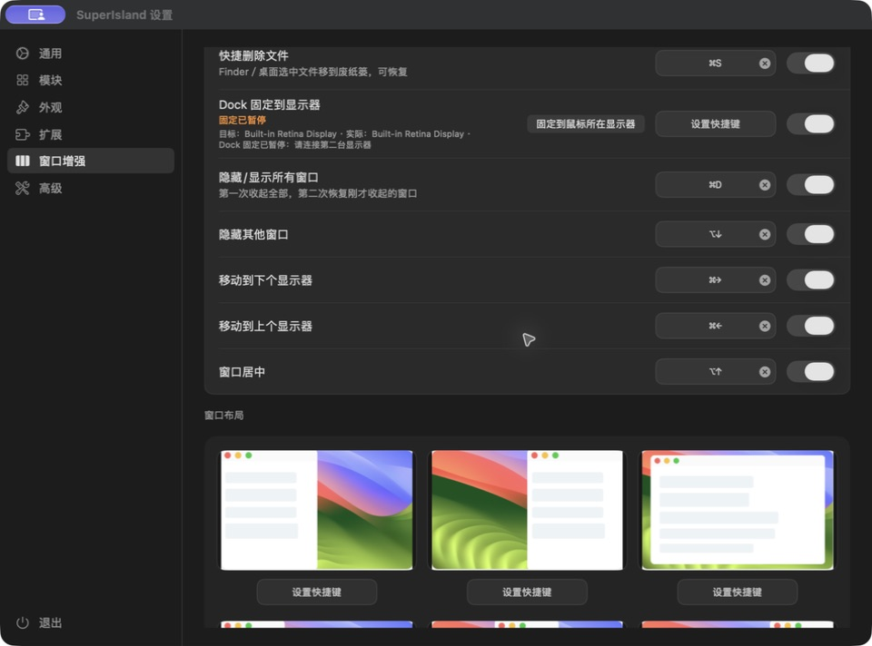
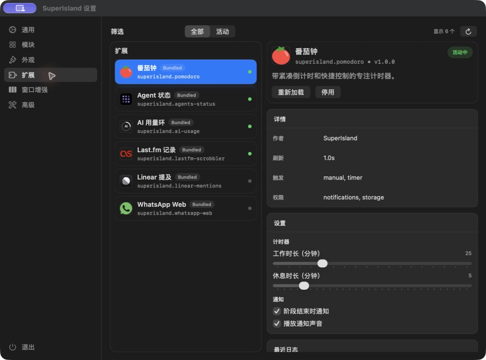
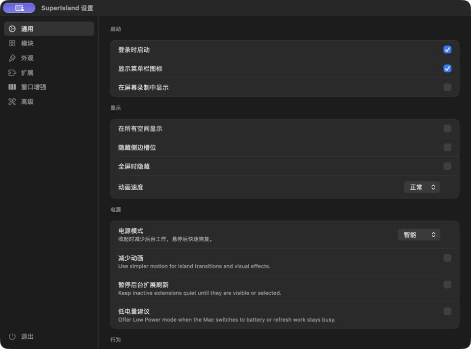

<p align="center">
  
</p>

<h1 align="center">SuperIsland</h1>

<p align="center">Mac 灵动岛与窗口增强工具：查看信息、整理临时文件、切换窗口，用更少操作完成日常任务。</p>

<p align="center">
  <a href="docs/WINDOW-ENHANCEMENTS.md">窗口与快捷键</a> ·
  <a href="docs/SHELF.md">暂存与 ZIP</a> ·
  <a href="docs/NOW_PLAYING.md">音乐</a> ·
  <a href="CHANGELOG.md">版本记录</a> ·
  <a href="docs/RELEASE.md">构建与打包</a>
</p>

## 当前版本

本仓库是在 [shobhit99/SuperIsland](https://github.com/shobhit99/SuperIsland) 基础上持续维护的版本。
当前维护分支为 [`fix/we1-codex-usage-refresh-20260921`](https://github.com/372790111z-wq/SuperIsland/tree/fix/we1-codex-usage-refresh-20260921)，`main` 尚未合入这些新增功能。

最近安装验证的构建为 **20260922004644**，应用名称为 **SuperIsland**。源码、使用说明和本机验证记录保存在本仓库；该构建目前为本机签名包，尚未发布 GitHub Release，也未经过 Apple 公证。上游安装包不包含这里的新增功能。

## 可以做什么

| 功能 | 使用方式 |
| --- | --- |
| 窗口预览 | 鼠标移到 Dock 图标，或使用 Cmd-Tab，查看应用窗口并选择目标窗口 |
| 窗口管理 | 边缘分屏、悬浮分屏岛、布局快捷键、跨显示器移动；在调度中心关闭选中的窗口 |
| 文件快捷删除 | 为 Finder／桌面选中的文件设置“移到废纸篓”快捷键，可恢复 |
| 隐藏／显示所有窗口 | 第一次收起，第二次恢复刚才收起的窗口 |
| 文件暂存 | 从 Finder／桌面拖入灵动岛，暂存、拖出、打开或调用系统共享面板 |
| 自动 ZIP | 把文件或文件夹拖到暂存架右侧压缩区，分别压缩，结果加入暂存架 |
| 音乐来源 | 点击整张封面区域返回正在运行的播放器；对已识别的浏览器来源尝试定位播放标签页 |
| 信息与扩展 | 音乐、电池、天气、日历、通知、口播稿，以及番茄钟、Agent 状态、AI 用量等扩展 |
| AI 用量 | 显示 Codex、Claude 可取得的额度；Codex 暂时刷新失败时标明延迟并有限保留上次读数 |

具体条件和操作见功能文档。窗口缩略图受应用及系统捕获能力限制；浏览器媒体定位需对应权限和已识别来源。某项未读取到数据，不等于用量为零。

## 界面截图

以下图片来自实际安装的 **004644** 设置窗口，拍摄于 **2026-09-22**。它们展示设置入口，图中的快捷键是当前机器的自定义配置；设置内置演示图不等于实际窗口操作结果。

**窗口增强**



**快捷删除与隐藏／显示窗口**



截图中 Dock 固定显示“已暂停”，是因为拍摄时仅连接一台显示器。

**扩展管理**



**通用设置**



[截图来源与说明](assets/screenshots/20260922/README.md)。此组截图不包含桌面文件、聊天、账号用量或私人内容。

## 开始使用

- 运行目标：macOS 14 或更新版本；本次安装验证使用 Apple Silicon Mac。
- 在“设置 → 窗口增强”开启所需功能，并设置自己的快捷键。
- 窗口操作需要辅助功能权限；本地缩略图需要屏幕录制权限，可在同页查看实际授权状态。
- 日历、定位、麦克风、语音识别和浏览器自动化等权限按使用的模块授予。
- “设置 → 扩展”可查看扩展状态、调整设置、重新加载或停用。需要第三方账号的扩展仍需分别配置。

旧测试版本曾使用 WE1 名称。当前应用已改为 SuperIsland，内部身份与数据目录保留以沿用现有设置；不要同时运行两个相同身份的版本。

## 从源码构建

```sh
git clone --branch fix/we1-codex-usage-refresh-20260921 https://github.com/372790111z-wq/SuperIsland.git
cd SuperIsland
```

构建需要 Xcode、XcodeGen，以及对应扩展打包工具。最近构建使用 Xcode 27.0；当前维护构建使用独立应用身份，并预先准备 WhatsApp provider，不能直接照用上游打包脚本覆盖现有应用。

完整步骤与签名边界见 [构建与发行说明](docs/RELEASE.md)；本机优化包使用 [本地 Release 打包器](docs/local-release-packaging.md)。这些脚本不会代替用户完成系统权限授权。

## 文档导航

- [窗口预览、分屏和快捷键](docs/WINDOW-ENHANCEMENTS.md)
- [文件暂存与自动 ZIP](docs/SHELF.md)
- [音乐控制与打开来源](docs/NOW_PLAYING.md)
- [AI 用量环与刷新行为](Extensions/ai-usage/README.md)
- [扩展开发](EXTENSIONS.md) · [扩展 API](EXTENSIONS-API.md)
- [日历](docs/CALENDAR.md) · [通知](docs/NOTIFICATIONS.md) · [外观](docs/APPEARANCE.md) · [能耗](docs/ENERGY.md)
- [版本记录](CHANGELOG.md) · [构建与发行](docs/RELEASE.md)

## 验证与反馈

本分支保存了分阶段测试及安装记录，见 [docs/checkpoints](docs/checkpoints)。已通过的测试、已安装构建和用户实际验收分别记录；例如 Codex 用量修复已经安装，但长时间刷新表现仍需日常使用验证。

报告问题时请说明构建号、触发入口（Dock／Cmd-Tab／调度中心／灵动岛）、窗口状态和复现步骤。截图先移除私人信息，不要上传登录令牌、完整账号配置或个人文件内容。

## 项目结构

```text
SuperIsland/       macOS 应用、模块、设置、窗口增强
ExtensionHost/     JavaScriptCore 扩展运行时与系统桥接
Extensions/        内置扩展
SuperIslandTests/  原生测试
scripts/           构建、打包及脚本测试
docs/              使用说明和验证记录
assets/screenshots/ 当前应用的公开界面截图
```

感谢上游 SuperIsland 及其贡献者。上游项目、网站和发行记录属于各自维护者；本仓库的功能与构建状态以当前分支文档为准。
